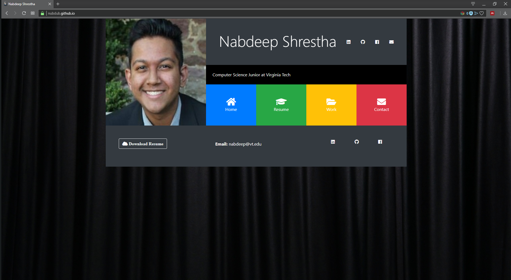

# My Personal Website

This website was designed using a bit of JQuery and the Flexbox classes from Bootstrap.css. The icons were obtained from FontAwesome.com. I intend on making this website my personal portfolio which I plan on updating as I continue my college and professional careers.

The website opens to the Home tab, and each of the tabs are collapsable. To the right of my name at the top of the page are my social media links represented by their respective icon. At the page footer are a link to download my resume, my email address, and social media links.

!https://nubdub.github.io
